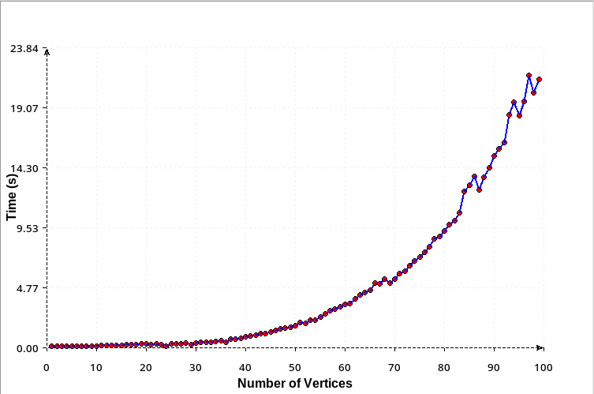

# Graph Isomorphism Problem
The Graph Isomorphism Problem is the computational problem of determining whether two finite graphs are isomorphic.  
Two graphs  
$$G_1 = (V_1, E_1)$$
  
and  
$$G_2 = (V_2, E_2)$$
  
are isomorphic if there exists a bijection  
$$f: V_1 \to V_2$$
  
such that  
$$(u, v) \in E_1 \iff (f(u), f(v)) \in E_2$$


# CNF encoding procedure


## Adjacency Matrix Representation
I chose to represent the graphs using an adjacency matrix, this way I can easily access the edges of the graphs in constant time. At the same time every vertex can by represented by a number from 1 to n, where n is the number of vertices in the graph.


## Variables
To encode the problem in CNF, I realized that I need to create variables that represent the mapping of vertices from one graph to another. That way in the end I can check if the edges are preserved under this mapping.  
I created variables of the form  
$$x_{i,j}$$
  
where $i \in V_1$, $j \in V_2$ so that:  
$$(x_{i,j} = True) \iff (f(i) = j)$$

## Creating clauses
I need to split the problem into smaller subproblems and create clauses for each of them.


### $f$ is a function
"Official" definition:  
$$\forall v \in V_1 : \exists! f(v) \in V_2$$
  
in the language of our variables:  
"There isn't any pair from $V_1$ that share the same image in $V_2$"  
$$(\forall i \in V_1 )(\forall m,n \in V_2, m \neq n)(\neg x_{i,m} \lor \neg x_{i,n})$$
  

### $f$ is defined for $\forall i \in V_1$
"Official" definition:  
$$\forall v \in V_1 : \exists f(v) \in V_2$$
  
in the language of our variables:  
"For every vertex in $V_1$ there is at least one vertex in $V_2$ that is its image"  
$$(\forall i \in V_1)(x_{i,0} \lor x_{i,1} \lor ... \lor x_{i,|V_2|-1})$$
  

### $f$ is injective
"Official" definition:  
$$\forall u,v \in V_1, u \neq v : f(u) \neq f(v)$$
  
in the language of our variables:  
"There isn't any pair from $V_2$ that share the same preimage in $V_1$"  
$$(\forall j \in V_2)(\forall m,n \in V_1, m \neq n)(\neg x_{m,j} \lor \neg x_{n,j})$$
  

### $f$ is surjective
"Official" definition:  
$$\forall w \in V_2 : \exists v \in V_1 : f(v) = w$$
  
in the language of our variables:  
"For every vertex in $V_2$ there is at least one vertex in $V_1$ that maps to it"  
$$(\forall j \in V_2)(x_{0,j} \lor x_{1,j} \lor ... \lor x_{|V_1|-1,j})$$
  

### Edges are preserved
"Official" definition:  
$$\forall u,v \in V_1 : (u,v) \in E_1 \iff (f(u), f(v)) \in E_2$$
  
in the language of our variables:  
"There doesn't exist any edge in $E_1$ that is not mapped to an edge in $E_2$ and vice versa"  
  
$(\forall u,v \in V_1)(\forall i,j \in V_2):$  
$(((u,v) \in E_1 \space \land \space (i,j) \not\in E_2) \lor ((u,v) \not\in E_1 \space \land \space (i,j) \in E_2) \implies (\neg x_{u,i} \lor \neg x_{v,i}))$

# User documentation
## Dependencies
### Glucose SAT solver
The program requires the Glucose SAT solver to be installed and compiled in a directory named "glucose" next to the main program directory. It relies on the version 4.2.1 accessible at: 
https://github.com/audemard/glucose/  
(the path to the glucose executable can be easily changed modifying a single variable at the beginning of the program.py)
### Python 3.12
The program requires Python 3.12 or higher to run.
## Running the code
### Execution
To run the program, navigate the the folder called "sat-solver-graph-isomorphism" and run the following command:
```
python program.py <path_to_graph1> <path_to_graph2> <options>
```
### Options
#### Show statistics from Glucose
```
-show-stats
```
<details>

<summary> example </summary>

From easy to verify output from tests/g[1,2]-easy-true.txt  

```
------------ GLUCOSE STATISTICS ------------
c
c This is glucose 4.2.1 --  based on MiniSAT (Many thanks to MiniSAT team)
c
c ========================================[ Problem Statistics ]===========================================
c |                                                                                                       |
c |  Number of variables:            16                                                                   |
c |  Number of clauses:             200                                                                   |
c |  Parse time:                   0.00 s                                                                 |
c |                                                                                                       |
c | Preprocesing is fully done
c |  Simplification time:          0.00 s                                                                 |
c |                                                                                                       |
c ========================================[ MAGIC CONSTANTS ]==============================================
c | Constants are supposed to work well together :-)                                                      |
c | however, if you find better choices, please let us known...                                           |
c |-------------------------------------------------------------------------------------------------------|
c | Adapt dynamically the solver after 100000 conflicts (restarts, reduction strategies...)               |
c |-------------------------------------------------------------------------------------------------------|
c |                                |                                |                                     |
c | - Restarts:                    | - Reduce Clause DB:            | - Minimize Asserting:               |
c |   * LBD Queue    :     50      |   * First     :   2000         |    * size <  30                     |
c |   * Trail  Queue :   5000      |   * Inc       :    300         |    * lbd  <   6                     |
c |   * K            :   0.80      |   * Special   :   1000         |                                     |
c |   * R            :   1.40      |   * Protected :  (lbd)< 30     |                                     |
c |                                |                                |                                     |
c ==================================[ Search Statistics (every  10000 conflicts) ]=========================
c |                                                                                                       |
c |          RESTARTS           |          ORIGINAL         |              LEARNT              | Progress |
c |       NB   Blocked  Avg Cfc |    Vars  Clauses Literals |   Red   Learnts    LBD2  Removed |          |
c =========================================================================================================
c last restart ## conflicts  :  1 1 
c =========================================================================================================
c restarts              : 1 (1 conflicts in avg)
c blocked restarts      : 0 (multiple: 0) 
c last block at restart : 0
c nb ReduceDB           : 0
c nb removed Clauses    : 0
c average learnt size   : 1
c nb learnts DL2        : 0
c nb learnts size 2     : 0
c nb learnts size 1     : 1
c conflicts             : 1              (672 /sec)
c decisions             : 6              (0.00 % random) (4030 /sec)
c propagations          : 19             (12760 /sec)
c nb reduced Clauses    : 1
c LCM                   : 0 / 0 
c CPU time              : 0.001489 s

s SATISFIABLE
SAT

```

</details>

#### Show the DIMACS CNF format
```
-show-cnf
```
<details>
<summary> example </summary>
From easy to verify output from tests/g[1,2]-easy-true.txt  

```
---------------- DIMACS CNF ----------------
p cnf 16 200
1 2 3 4 0
5 6 7 8 0
9 10 11 12 0
13 14 15 16 0
-1 -2 0
-1 -3 0
-1 -4 0
-2 -1 0
-2 -3 0
-2 -4 0
-3 -1 0
-3 -2 0
-3 -4 0
-4 -1 0
-4 -2 0
-4 -3 0
-5 -6 0
-5 -7 0
-5 -8 0
-6 -5 0
-6 -7 0
-6 -8 0
-7 -5 0
-7 -6 0
-7 -8 0
-8 -5 0
-8 -6 0
-8 -7 0
-9 -10 0
-9 -11 0
-9 -12 0
-10 -9 0
-10 -11 0
-10 -12 0
-11 -9 0
-11 -10 0
-11 -12 0
-12 -9 0
-12 -10 0
-12 -11 0
-13 -14 0
-13 -15 0
-13 -16 0
-14 -13 0
-14 -15 0
-14 -16 0
-15 -13 0
-15 -14 0
-15 -16 0
-16 -13 0
-16 -14 0
-16 -15 0
-1 -5 0
-2 -6 0
-3 -7 0
-4 -8 0
-1 -9 0
-2 -10 0
-3 -11 0
-4 -12 0
-1 -13 0
-2 -14 0
-3 -15 0
-4 -16 0
-5 -1 0
-6 -2 0
-7 -3 0
-8 -4 0
-5 -9 0
-6 -10 0
-7 -11 0
-8 -12 0
-5 -13 0
-6 -14 0
-7 -15 0
-8 -16 0
-9 -1 0
-10 -2 0
-11 -3 0
-12 -4 0
-9 -5 0
-10 -6 0
-11 -7 0
-12 -8 0
-9 -13 0
-10 -14 0
-11 -15 0
-12 -16 0
-13 -1 0
-14 -2 0
-15 -3 0
-16 -4 0
-13 -5 0
-14 -6 0
-15 -7 0
-16 -8 0
-13 -9 0
-14 -10 0
-15 -11 0
-16 -12 0
1 5 9 13 0
2 6 10 14 0
3 7 11 15 0
4 8 12 16 0
-1 -2 0
-2 -3 0
-3 -1 0
-4 -3 0
-1 -5 0
-1 -7 0
-1 -8 0
-2 -5 0
-2 -6 0
-2 -8 0
-3 -6 0
-3 -7 0
-3 -8 0
-4 -5 0
-4 -6 0
-4 -8 0
-1 -10 0
-2 -11 0
-3 -9 0
-4 -11 0
-1 -14 0
-2 -15 0
-3 -13 0
-4 -15 0
-5 -2 0
-6 -3 0
-7 -1 0
-8 -3 0
-5 -6 0
-6 -7 0
-7 -5 0
-8 -7 0
-5 -9 0
-5 -11 0
-5 -12 0
-6 -9 0
-6 -10 0
-6 -12 0
-7 -10 0
-7 -11 0
-7 -12 0
-8 -9 0
-8 -10 0
-8 -12 0
-5 -14 0
-6 -15 0
-7 -13 0
-8 -15 0
-9 -2 0
-10 -3 0
-11 -1 0
-12 -3 0
-9 -6 0
-10 -7 0
-11 -5 0
-12 -7 0
-9 -10 0
-10 -11 0
-11 -9 0
-12 -11 0
-9 -13 0
-9 -15 0
-9 -16 0
-10 -13 0
-10 -14 0
-10 -16 0
-11 -14 0
-11 -15 0
-11 -16 0
-12 -13 0
-12 -14 0
-12 -16 0
-13 -2 0
-14 -3 0
-15 -1 0
-16 -3 0
-13 -5 0
-13 -7 0
-13 -8 0
-14 -5 0
-14 -6 0
-14 -8 0
-15 -6 0
-15 -7 0
-15 -8 0
-16 -5 0
-16 -6 0
-16 -8 0
-13 -10 0
-14 -11 0
-15 -9 0
-16 -11 0
-13 -14 0
-14 -15 0
-15 -13 0
-16 -15 0
----------------  CNF END   ----------------

```

</details>

### Input format (graph files)
The adjacency matrix of a graph is expected to be in a single .txt file without any extra lines.  
Example:
```
0 1
0 0
```
Representing the graph 
```
0->1
```

# Description of included testing instances

## Easy to verify valid instance
After running the script:
```
python program.py tests/g1-easy-true.txt tests/g2-easy-true.txt
```
we get the following output
```
The graphs are isomorphic.
Here is how to rename the vertices:
0 ---> 3
1 ---> 2
2 ---> 0
3 ---> 1
```
Listing how to map the vertices from g1 to g2 satisfies all the properties defined above, proving that the graphs are isomorphic  
where:  
G1 is:
```
0-->1
   /|
  / |
 /  |
v   v
3<--2
```
G2 is:
```
3-->2
   /|
  / |
 /  |
v   v
1<--0
```

## Easy to verify invalid instance

After running the script:  
```
python program.py tests/g1-easy-false.txt tests/g2-easy-false.txt
```

we get the following output:  
```
The graphs are not isomorphic.
```

Visually the graphs are,  
G1:
```
0 --> 1 <-- 2
```

G2:
```
0 --> 1 --> 2
```

## Instance running in non-trivial time

After running the script:  
```
python program.py tests/g1-takes-long.txt tests/g2-takes-long.txt
```

we get the following output:  

<details>

<summary> Output: </summary>

```
The graphs are isomorphic.
Here is how to rename the vertices:
0 ---> 79
1 ---> 78
2 ---> 77
3 ---> 76
4 ---> 75
5 ---> 74
6 ---> 73
7 ---> 72
8 ---> 71
9 ---> 70
10 ---> 69
11 ---> 68
12 ---> 67
13 ---> 66
14 ---> 65
15 ---> 64
16 ---> 63
17 ---> 62
18 ---> 61
19 ---> 60
20 ---> 59
21 ---> 58
22 ---> 57
23 ---> 56
24 ---> 55
25 ---> 54
26 ---> 53
27 ---> 52
28 ---> 51
29 ---> 50
30 ---> 49
31 ---> 48
32 ---> 47
33 ---> 46
34 ---> 45
35 ---> 44
36 ---> 43
37 ---> 42
38 ---> 41
39 ---> 40
40 ---> 39
41 ---> 38
42 ---> 37
43 ---> 36
44 ---> 35
45 ---> 34
46 ---> 33
47 ---> 32
48 ---> 31
49 ---> 30
50 ---> 29
51 ---> 28
52 ---> 27
53 ---> 26
54 ---> 25
55 ---> 24
56 ---> 23
57 ---> 22
58 ---> 21
59 ---> 20
60 ---> 19
61 ---> 18
62 ---> 17
63 ---> 16
64 ---> 15
65 ---> 14
66 ---> 13
67 ---> 12
68 ---> 11
69 ---> 10
70 ---> 9
71 ---> 8
72 ---> 7
73 ---> 6
74 ---> 5
75 ---> 4
76 ---> 3
77 ---> 2
78 ---> 1
79 ---> 0
```

</details>
  

Where the graphs are:  
- G1 - full graph with 80 vertices
- G2 - same as the graph G1

# Instance experiments and results
I ran a performance test, where I gradually increased the number of vertices of 2 complete graphs  

